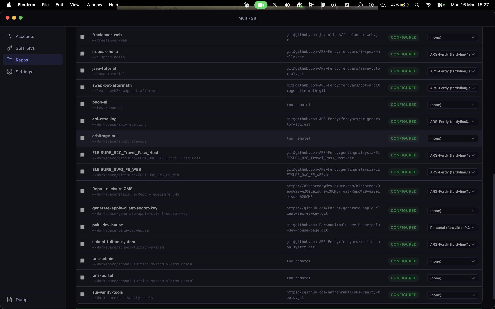
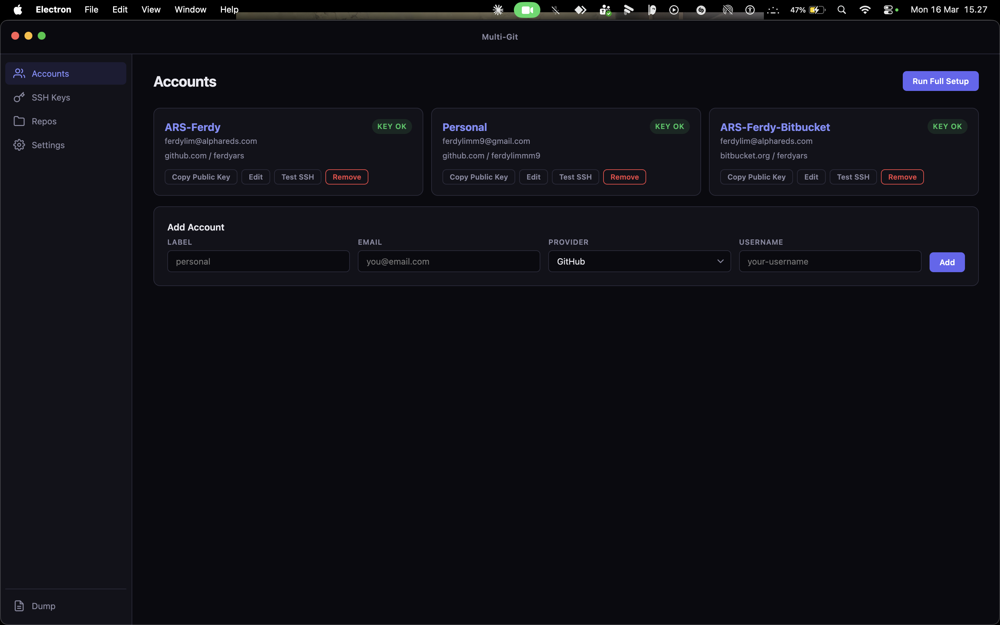

# Multi-Git Controller

Manage multiple SSH keys and Git accounts across GitHub, GitLab, Bitbucket and others — with **verified (signed) commits**, no GPG required.

Includes a CLI and an Electron desktop app.

## Preview

| Accounts | Repos |
|----------|-------|
|  |  |

---

## Download

### Desktop App (Electron)

| Platform | Download | Type |
|----------|----------|------|
| macOS (Intel + Apple Silicon) | [Multi-Git-Controller.dmg](https://github.com/palu-dev-house/multi-git-controller/releases/latest/download/Multi-Git-Controller.dmg) | Installer |
| macOS (zip) | [Multi-Git-Controller-mac.zip](https://github.com/palu-dev-house/multi-git-controller/releases/latest/download/Multi-Git-Controller-mac.zip) | Portable |
| Windows (installer) | [Multi-Git-Controller-Setup.exe](https://github.com/palu-dev-house/multi-git-controller/releases/latest/download/Multi-Git-Controller-Setup.exe) | Installer |
| Windows (portable) | [Multi-Git-Controller.exe](https://github.com/palu-dev-house/multi-git-controller/releases/latest/download/Multi-Git-Controller.exe) | Portable |
| Linux (AppImage) | [Multi-Git-Controller.AppImage](https://github.com/palu-dev-house/multi-git-controller/releases/latest/download/Multi-Git-Controller.AppImage) | Portable |
| Linux (deb) | [multi-git-controller.deb](https://github.com/palu-dev-house/multi-git-controller/releases/latest/download/multi-git-controller.deb) | Package |

> All downloads are on the [Releases](https://github.com/palu-dev-house/multi-git-controller/releases) page.

### CLI Only

No download needed — just clone the repo and run the shell scripts:

```bash
git clone https://github.com/palu-dev-house/multi-git-controller.git
cd multi-git-controller
cp accounts.conf.example accounts.conf
# Edit accounts.conf with your accounts
./multi-git.sh setup
```

---

## Installation

### macOS

1. Download the `.dmg` file from [Releases](https://github.com/palu-dev-house/multi-git-controller/releases)
2. Open the `.dmg` and drag **Multi-Git Controller** to Applications
3. On first launch, right-click the app and select "Open" (macOS Gatekeeper will block unsigned apps)
4. Grant Terminal/SSH access if prompted

### Windows

1. Download `Multi-Git-Controller-Setup.exe` from [Releases](https://github.com/palu-dev-house/multi-git-controller/releases)
2. Run the installer — choose install location
3. Launch from Start Menu or Desktop shortcut
4. Requires: Git for Windows with SSH support (Git Bash)

Or use the portable `.exe` — no installation needed, just run it.

### Linux

**AppImage:**
```bash
chmod +x Multi-Git-Controller.AppImage
./Multi-Git-Controller.AppImage
```

**Debian/Ubuntu:**
```bash
sudo dpkg -i multi-git-controller.deb
```

### From Source

```bash
git clone https://github.com/palu-dev-house/multi-git-controller.git
cd multi-git-controller/app
npm install
npm start
```

### Build Installers Locally

```bash
cd app
npm install
npm run build          # Build for current platform
npm run build:mac      # macOS .dmg + .zip
npm run build:win      # Windows .exe installer + portable
npm run build:linux    # Linux AppImage + .deb
```

Outputs go to `app/dist/`.

---

## The Problem

When you have multiple Git accounts (personal, work, freelance), you need:

- **Separate SSH keys** per account for independent authentication
- **Correct `user.name` + `user.email`** per repo so commits are attributed correctly
- **Commit signing** so platforms show your commits as **"Verified"**

Multi-Git Controller automates all of it using **SSH key signing** (Git 2.34+, no GPG needed).

---

## Project Structure

```
multi-git-controller/
├── multi-git.sh              # CLI entry point
├── lib.sh                    # Shared helpers (colors, account loader)
├── cmd-setup.sh              # Generate keys + SSH config + git configs
├── cmd-repo.sh               # Configure a repo for a specific account
├── cmd-dump.sh               # Show all current settings
├── cmd-transfer.sh           # Export/import settings between machines
├── accounts.conf.example     # Example config (safe to commit)
├── accounts.conf             # Your real accounts (gitignored)
├── .gitignore
├── README.md
└── app/                      # Electron desktop app
    ├── package.json           # App config + electron-builder config
    ├── main.js                # Main process + IPC handlers
    ├── preload.js             # Context bridge (main <-> renderer)
    ├── index.html             # UI layout
    ├── styles.css             # Dark theme + responsive styles
    └── renderer.js            # UI logic + event handling
```

---

## Quick Start

### 1. Configure accounts

**Desktop app:** Open the app, go to Accounts tab, fill in the form and click Add.

**CLI:**
```bash
cp accounts.conf.example accounts.conf
```

Edit `accounts.conf`:

```
personal|you@personal.com|github.com|your-username
work|you@company.com|github.com|your-work-username
freelance|you@freelance.com|bitbucket.org|your-bitbucket-user
```

Format: `LABEL|EMAIL|GIT_HOST|GIT_USER`

### 2. Run setup

**Desktop app:** Click **Run Full Setup** on the Accounts tab.

**CLI:**
```bash
./multi-git.sh setup
```

This generates:

- SSH key pair per account (`~/.ssh/id_ed25519_<label>`)
- SSH config with host aliases (`github.com-personal`, `bitbucket.org-work`, etc.)
- `~/.ssh/allowed_signers` for SSH signature verification
- Per-account git config (`~/.gitconfig-<label>`)

### 3. Add public keys to your Git provider

Each key must be added as **both** an authentication key and a signing key.

**Desktop app:** Go to SSH Keys tab, click **Copy** next to the public key, paste it into your provider.

**CLI:**
```bash
./multi-git.sh keys
```

| Provider | Auth Key | Signing Key |
|----------|----------|-------------|
| **GitHub** | Settings > SSH and GPG keys > Authentication Key | Settings > SSH and GPG keys > Signing Key |
| **GitLab** | Preferences > SSH Keys (check both boxes) | Same key, enable "signing" usage |
| **Bitbucket** | Personal settings > SSH keys | Same key (signing auto-detected) |

### 4. Configure repos

**Desktop app:** Go to Repos tab, click **Scan Repos** to auto-discover all git repos on your machine, select accounts, click **Apply Selected**.

**CLI:**
```bash
cd ~/projects/my-work-repo
/path/to/multi-git.sh repo work
```

### 5. Verify

```bash
# Test SSH connections
./multi-git.sh test

# Make a test commit and verify signature
git commit --allow-empty -m "test: verify signing"
git log --show-signature -1
```

---

## Desktop App Features

| Tab | What it does |
|-----|--------------|
| **Accounts** | Add/edit/remove accounts, generate SSH keys, test SSH, run full setup |
| **SSH Keys** | View keys with fingerprints, copy public key to clipboard, test connections |
| **Repos** | Auto-scan all git repos on your machine, bulk-assign accounts, one-click apply |
| **Settings** | View SSH config and gitconfig, export/import for machine migration |
| **Dump** | Full diagnostic dump of all settings |

### Repo Scanner

1. Click **Scan Repos** — searches your home directory (skips node_modules, Library, .cache, etc.)
2. Shows live progress with a log of each discovered repo
3. Auto-detects which account matches each repo (by email or remote URL)
4. Select an account from the dropdown for unconfigured repos
5. Check the repos you want, click **Apply Selected**

### Responsive Layout

The app adapts to different window sizes:

- **Wide (860px+)** — Full sidebar with labels
- **Medium (680-860px)** — Icon-only sidebar, single-column settings
- **Narrow (<680px)** — Stacked forms, scrollable tables
- **Compact (<500px)** — Ultra-compact for small windows

---

## CLI Commands

| Command | Description |
|---------|-------------|
| `setup` | Generate keys, SSH config, allowed_signers, git configs |
| `repo <label>` | Configure current repo for a specific account |
| `keys` | Print all public keys |
| `test` | Test SSH authentication for all accounts |
| `dump` | Show all SSH + Git settings with verification status |
| `export [dir]` | Bundle keys + configs into `~/multi-git-export.tar.gz` |
| `import [dir]` | Restore from an exported bundle |
| `help` | Show help |

---

## How It Works

### SSH Host Aliases

The setup creates host aliases in `~/.ssh/config`:

```
Host github.com-personal
  HostName github.com
  User git
  IdentityFile ~/.ssh/id_ed25519_personal
  IdentitiesOnly yes

Host github.com-work
  HostName github.com
  User git
  IdentityFile ~/.ssh/id_ed25519_work
  IdentitiesOnly yes
```

When a repo's remote is `git@github.com-work:org/repo.git`, SSH uses the work key automatically.

### SSH Commit Signing

Git 2.34+ signs commits with SSH keys (no GPG needed). Each account's git config:

```ini
[user]
  signingkey = ~/.ssh/id_ed25519_work.pub
[gpg]
  format = ssh
[commit]
  gpgsign = true
```

The platform verifies the signature if the same public key is uploaded as a **Signing Key**.

### Allowed Signers

`~/.ssh/allowed_signers` tells `git verify-commit` which keys are trusted:

```
you@company.com ssh-ed25519 AAAA...
you@personal.com ssh-ed25519 AAAA...
```

---

## Directory-Based Auto-Config (Optional)

Instead of running `repo <label>` per repo, auto-apply configs by directory:

```ini
# ~/.gitconfig
[includeIf "gitdir:~/projects/personal/"]
  path = ~/.gitconfig-personal

[includeIf "gitdir:~/projects/work/"]
  path = ~/.gitconfig-work
```

Then organize repos under those directories. You still need to set the remote URL host alias once per repo.

---

## Migrating to a New Machine

**Desktop app:** Settings tab > Export Settings / Import Settings.

**CLI:**
```bash
# Old machine
./multi-git.sh export

# Transfer ~/multi-git-export.tar.gz to new machine

# New machine
tar -xzf multi-git-export.tar.gz -C ~/
./multi-git.sh import ~/multi-git-export
./multi-git.sh dump   # verify
./multi-git.sh test   # test connections
```

The export includes: SSH keys, SSH config, allowed_signers, per-account git configs, global gitconfig, and accounts.conf.

---

## Troubleshooting

### "Permission denied (publickey)"

```bash
# Check which key SSH is offering
ssh -vT git@github.com-work 2>&1 | grep "Offering"

# Verify key is loaded
ssh-add -l

# Manually add the key
ssh-add ~/.ssh/id_ed25519_work
```

### Commits not showing as "Verified"

1. Ensure the public key is added as a **Signing Key** (not just Auth) on the provider
2. Check the email matches: `git config user.email` must match the email on your account
3. Verify signing is enabled: `./multi-git.sh dump`
4. For Bitbucket: add the SSH key in Personal Settings > SSH keys

### "error: Load key ... invalid format"

The signing key must point to the `.pub` file:

```bash
git config user.signingkey ~/.ssh/id_ed25519_work.pub  # correct
# NOT ~/.ssh/id_ed25519_work (private key)
```

### Git version too old

SSH signing requires Git 2.34+:

```bash
git --version
# macOS: brew install git
# Ubuntu: sudo add-apt-repository ppa:git-core/ppa && sudo apt update && sudo apt install git
```

### macOS "app is damaged" or Gatekeeper block

```bash
xattr -cr /Applications/Multi-Git\ Controller.app
```

Or right-click the app > Open (bypasses Gatekeeper on first launch).

---

## Supported Providers

| Provider | Auth | Signing | Verified Commits |
|----------|------|---------|------------------|
| GitHub | SSH key | SSH key (separate upload) | Yes |
| GitLab | SSH key | Same key (enable signing usage) | Yes |
| Bitbucket | SSH key | Same key | Yes |
| Codeberg | SSH key | SSH key | Yes |
| Gitea | SSH key | SSH key | Yes |
| SourceHut | SSH key | SSH key | Yes |
| Azure DevOps | SSH key | GPG only (SSH signing not supported) | No |

---

## Requirements

- **Git 2.34+** — SSH signing support
- **OpenSSH 8.0+** — ed25519 keys
- **Bash 4+** — CLI scripts
- **Node.js 18+** — only needed to build the Electron app from source

---

## License

MIT
